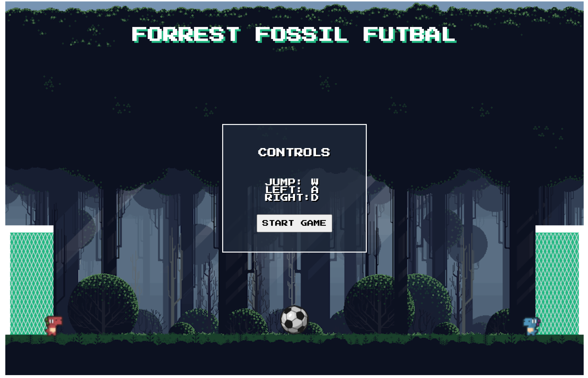

<!-- Background Music by <a href="/users/placidplace-25572496/?tab=audio&amp;utm_source=link-attribution&amp;utm_medium=referral&amp;utm_campaign=audio&amp;utm_content=108380">Placidplace</a> from <a href="https://pixabay.com/?utm_source=link-attribution&amp;utm_medium=referral&amp;utm_campaign=music&amp;utm_content=108380">Pixabay</a> -->

# FORREST FOSSIL FUTBOL

 
## A game for those who enjoy soccer/footy/futbol but wondered what it would be like if tiny cute dinosaurs played the world's game. play on your computer or your phone!
## https://forrest-fossil-futbol.netlify.app/
 

### Built with vanilla Javascript and HTML canvas.

 
Please feel free to make suggestions to imporve the game or report bugs
Be it imporved physics, differnt controls for mobile, or dissapearing ball/dino, or tweaks to the code structure it all will be greatly appreacited!
 
 

CREDITS :

        Joystick Logic:
        the JoyStick Project (https://github.com/bobboteck/JoyStick).
        Copyright (c) 2015 Roberto D'Amico (Bobboteck).

        ART:
                Dino Art by @ScissorMarks (twitter handle)
                itch.io link https://arks.itch.io/dino-characters

                Background Art by edermuniz
                info :
                Itch.io: https://edermunizz.itch.io/

                Twitter: @EdermuniZpixels
                Instagram: @edermuniz
                email: edermuniz14@gmail.com
                Game Dev Market: https://www.gamedevmarket.net/member/edermuniz14/
                website: https://edermuniz.carrd.co/

